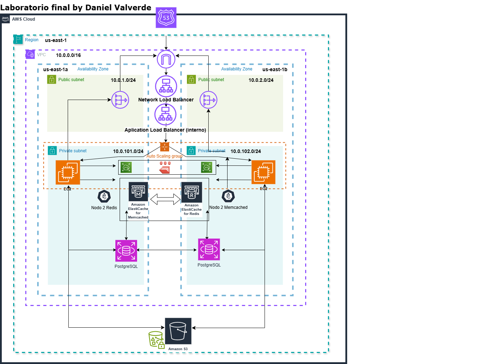

################################
Acceder a cuenta admin WordPress

https://privnote.com/XS7kDddc
La contraseña para descifrar y obtener las credenciales de WordPress es tu nombre con la primera letra en mayúscula.
################################

# **Arquitectura de Infraestructura  AWS -**

## **Descripción General**

Esta arquitectura está diseñada para ofrecer alta disponibilidad, seguridad, escalabilidad y rendimiento en una infraestructura que aloja una aplicación WordPress con almacenamiento de medios y gestión de caché eficiente. La solución utiliza una combinación de servicios de AWS, como VPC, EC2, Auto Scaling, EFS, IAM, NLB, ALB, Memcached, Redis, Route 53, S3, RDS y más. Además, la infraestructura está optimizada para un entorno colaborativo mediante el uso de **Terraform** con **S3** y **DynamoDB**.

## **Componentes de la Arquitectura**

### **Redes y Subredes**
- **VPC**: Configurada para organizar todos los recursos dentro de una red privada segura.
  - **Subredes Públicas**: 
   Para instancias que requieren acceso público, como el network load balancer.
    
  - **Subredes Privadas**: 
    Para instancias internas que no requieren acceso directo a internet, como bases de datos.
    Para aplicaciones de backend y otros servicios privados.

### **Gateways**
- **Internet Gateway (IGW)**: Permite a las instancias en las subredes públicas acceder a internet.
- **NAT Gateway**: Permite a las instancias en subredes privadas acceder a internet sin estar expuestas directamente.

### **Escalado Automático (Auto Scaling)**
- **Auto Scaling Group (ASG)**: Gestiona el número de instancias EC2 en función de la carga. 
  - **Instancias EC2**: Ejecutan WordPress y otros servicios.
  - **Política de Auto Scaling**: Basada en el uso de la CPU (si supera el 70%), las instancias adicionales se lanzan automáticamente.
  
### **Balanceo de Carga**
- **Network Load Balancer (NLB)**: Maneja el tráfico entrante y lo distribuye a las instancias EC2 en subredes públicas.
- **Application Load Balancer (ALB)**: Balancea el tráfico entre las instancias EC2 en subredes privadas y permite configurar reglas de enrutamiento más avanzadas.

### **Certificados SSL**
- **SSL Configurado en el NLB y en las instancias EC2**: Tanto el ALB interno como las instancias EC2 están configuradas para soportar cifrado **end-to-end** utilizando certificados SSL. 
  - **SSL Termination**: El certificado SSL es gestionado en el balanceador de carga externo y se establece una conexión cifrada desde el cliente hasta el balanceador. Además, el tráfico entre el balanceador interno y las instancias EC2 también está cifrado.
  - **Configuración en `ssl.conf`**: El `servername` se configura dentro del archivo `ssl.conf` para asegurar el flujo de tráfico seguro en las instancias EC2.

### **Almacenamiento**
- **Elastic File System (EFS)**: Proporciona almacenamiento compartido entre las instancias EC2 para archivos estáticos como imágenes y medios.
- **S3 Bucket**: Se utiliza para almacenar imágenes y otros archivos estáticos, accesibles globalmente desde las instancias EC2.

### **Caché**
- **Memcached y Redis**: Ambos servicios están configurados para mejorar el rendimiento de la aplicación WordPress, gestionando caché de sesiones y datos en caché.

### **Gestión de Credenciales**
- **AWS Secrets Manager**: Configurado para almacenar y gestionar de manera segura las credenciales de la base de datos de WordPress y otras claves secretas.
- **KMS**: Utilizado para cifrar y proteger información sensible.

### **Monitoreo y Alarmas**
- **CloudWatch**: Se ha habilitado el monitoreo completo para las instancias EC2, RDS, Memcached, Redis, entre otros. Se han creado paneles personalizados con métricas relevantes para la visibilidad de la infraestructura.
  - **Alarmas de CloudWatch**: Configuradas para alertar sobre eventos críticos como altas tasas de uso de la CPU o problemas de conectividad.

### **IAM (Identity and Access Management)**
- **Roles de IAM**: Roles creados con políticas específicas para:
  - Acceder a **Secrets Manager**, **KMS**, **S3**, **EFS**, **SSM** y **CloudWatch**.
  - Permitir que las instancias EC2 que aloja WordPress obtengan las credenciales necesarias de manera segura.
  
### **Infraestructura como Código (IaC)**
- **Terraform**: El estado de la infraestructura se almacena en un **S3 bucket** y el **lock** en **DynamoDB** para habilitar un entorno colaborativo.
  - **Outputs**: Se han creado múltiples salidas (outputs) para ofrecer una visión más clara y detallada de la infraestructura.
  
### **Configuración en el Auto Scaling**
- **Launch Template**: En el template de lanzamiento del Auto Scaling se incluye un **userdata** que realiza las siguientes configuraciones:
  - Monta el sistema de archivos **EFS**.
  - Configura el nombre del servidor en el archivo `ssl.conf` para la conexión segura **end-to-end**.
  - Crea una página de prueba **HTML** para verificar que el **health check** del balanceador de carga funciona correctamente.

### **Otras Configuraciones Opcionales**
- **`userdata.sh`**: En el repositorio se incluye un script **userdata.sh** con una configuración adicional detallada para las instancias EC2, aunque se deja como opcional según las necesidades del entorno.

## **Flujo de Datos y Operaciones**

1. **Acceso a la Aplicación Web**:
   - Los usuarios acceden a la aplicación a través del **NLB**, que distribuye el tráfico a las instancias EC2 en las subredes públicas.
   - **WordPress** está configurado para utilizar **Memcached** y **Redis** para almacenar en caché los datos y mejorar la velocidad de acceso.

2. **Almacenamiento de Archivos y Medios**:
   - Los archivos estáticos como imágenes se almacenan en **S3** y se sirven directamente desde allí.
   - Las instancias de EC2 utilizan **EFS** para compartir archivos entre ellas.

3. **Base de Datos**:
   - Las credenciales de la base de datos se gestionan a través de **Secrets Manager** y se cargan automáticamente en las instancias EC2.

4. **Escalabilidad**:
   - La política de **Auto Scaling** ajusta el número de instancias EC2 basándose en el uso de la CPU. Si el uso de la CPU supera el 70%, se lanzan nuevas instancias.
   - **Redis** y **Memcached** se utilizan para manejar los picos de tráfico y mejorar el rendimiento.

5. **Certificados SSL y Seguridad**:
   - La infraestructura está completamente protegida con cifrado **SSL** tanto en el balanceador de carga externo como en las instancias EC2, garantizando una comunicación segura.

## **Diagrama de Arquitectura**

